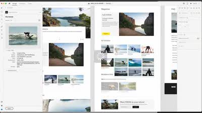
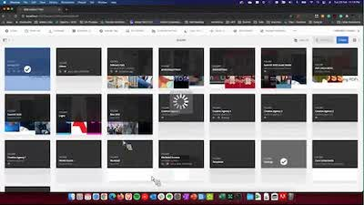
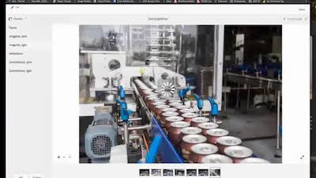

# Experience Manager Skill Builder Recordings

Welcome to the Adobe Experience Manager Skill Builder recordings. These are recorded webinars designed to build your knowledge base and maximize your investment in Adobe Experience Manager.

## What's New

<table>
<tr>
  <td>
    
    

      <a href="https://experienceleague.adobe.com/docs/experience-manager-skill-builder/skill-builder/2020/asset-link.html">
    <strong>Asset Link</strong>
    </a>
    

    

    <em>Asset Link is your native connection to Adobe Creative Cloud.</em>
    

  </td>
  <td>
    
    

    <a href="https://experienceleague.adobe.com/docs/experience-manager-skill-builder/skill-builder/2020/brand-portal.html">
    <strong>Brand Portal</strong>
    </a>
    

    

    <em>Easy asset sharing with internal and external teams.</em>
    

  </td>
  <td>
    
     

      <a href="https://experienceleague.adobe.com/docs/experience-manager-skill-builder/skill-builder/2020/dynamic-media.html">
        <strong>Dynamic Media</strong>
      </a>
    

    

    <em>Automate the output of assets for all channels and screens.</em>
    

  </td>
</tr>
</table>

>[!TIP]
>
>**See the navigation on the left for recordings from previous Skill Builder events**.

